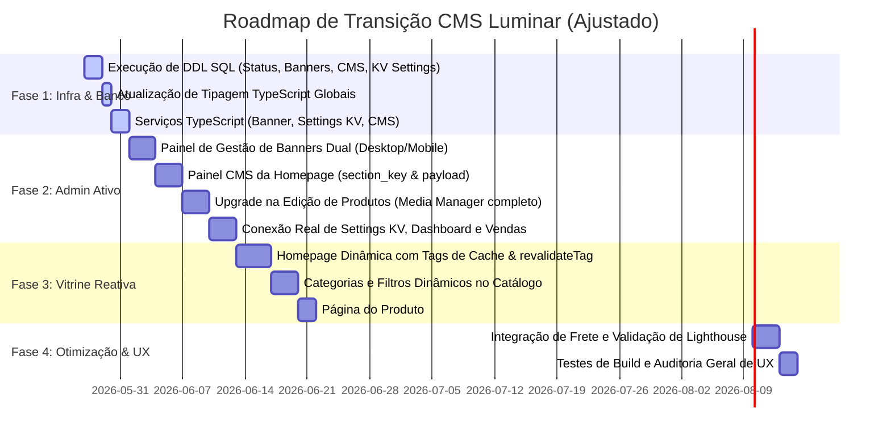

# Relatório de Auditoria de Acoplamento & Arquitetura CMS Luminar
## Transição Brutalmente Honesta para E-commerce Controlável de Luxo (Admin ↔ Supabase ↔ Storefront)

Este relatório apresenta uma análise técnica minuciosa da arquitetura do projeto Luminar. O objetivo desta auditoria é identificar todas as inconsistências de acoplamento entre o painel de administração (Admin), o banco de dados (Supabase) e a vitrine pública (Storefront), mapeando componentes desacoplados, fluxos de dados fraturados, fallbacks falsos, problemas de renderização (SSR/caching) e especificando a reestruturação da galeria de imagens para a tabela profissional `product_images` (excluindo a coluna física `image_url` da tabela `products`).

---

## 🏗️ 1. Mapeamento dos Componentes Hardcoded e Mocks

Realizamos uma varredura completa no código-fonte e catalogamos todos os elementos estáticos, arrays simulados e mocks de dados ativos que impedem a dinâmica real do e-commerce.

### A. Elementos Visuais e Banners Fixos
* **Hero Banner (`app/page.tsx` - Linhas 26-33):**
  A imagem da modelo de luxo que ilustra a homepage é proveniente de um link estático no Google User Content (`https://lh3.googleusercontent.com/aida-public/...`). Não há controle dinâmico de texto, link, imagem ou ordem pelo painel Admin.
* **Benefícios da Grife (`app/page.tsx` - Linhas 62-78):**
  Os três pilares da marca ("Frete Grátis", "Garantia Vitalícia" e "Embalagem Luxo") com seus respectivos ícones são desenhados diretamente no HTML. O lojista é incapaz de alterar os benefícios oferecidos sem modificar o código-fonte.
* **Cards de Categorias Manuais (`app/page.tsx` - Linhas 102-158):**
  Existem exatamente 3 blocos fixos na Home ("Anéis", "Correntes" e "Pulseiras"). As imagens deles são links manuais hardcoded, ignorando totalmente a tabela `categories` do Supabase (onde o admin gerencia as categorias reais com upload e exclusão física no Storage). Clicar neles joga o usuário para o catálogo genérico `/categoria`, sem aplicar filtros.
* **CTA Promocional Final (`app/page.tsx` - Linhas 165-182):**
  A frase "Cada peça é produzida sob encomenda..." e os botões de ação ("Explorar Coleção" e "Personalizar Joia") são estáticos no rodapé da página inicial.

### B. Mocks de Dados e Fallbacks Falsos
* **Fallback Picsum na Galeria do Produto (`app/produto/[id]/page.tsx` - Linhas 48-53):**
  Se o produto não possuir imagens no banco, ele cai no placeholder Picsum. O pior problema de fidelidade arquitetural está nas miniaturas secundárias (Thumb 2 e Thumb 3): elas utilizam mocks diretos do Picsum (`https://picsum.photos/seed/${product.id}detail1/800/800`), enganando o usuário com uma galeria de imagens falsas geradas aleatoriamente em vez de ler fotos secundárias reais da joia.
* **Filtros Decorativos no Catálogo (`app/categoria/page.tsx` - Linhas 25-38):**
  Os dropdowns "Coleção", "Preço" e "Material" são meras cascas de interface visual. Não possuem lógica reativa no Next.js para enviar query parameters ao Supabase e filtrar as joias de verdade. Clicar no botão "Ver mais peças" não realiza paginação de dados.
* **Tabela de Clientes Fake (`app/admin/(dashboard)/customers/page.tsx` - Linhas 6-11):**
  O admin de clientes exibe a constante estática `CUSTOMERS_MOCK` contendo 4 clientes inventados com e-mails, totais gastos e datas arbitrárias. Ela está totalmente cega e desconectada da tabela física `customers` que recebe dados reais das transações.
* **Estatísticas e Pedidos Simulados no Dashboard (`app/admin/(dashboard)/dashboard/page.tsx` - Linhas 17-40):**
  * O painel exibe números fixos (Faturamento de R$ 145.280, 24 pedidos, ticket médio de R$ 6.053) no array imutável `STATS`.
  * Os pedidos recentes são carregados do array simulado `RECENT_ORDERS`. O admin não consegue visualizar vendas reais efetuadas no checkout.
  * O gráfico de desempenho utiliza o array de mock `CHART_DATA` para desenhar as curvas do Recharts.
* **Configurações Gerais Inertes (`app/admin/(dashboard)/settings/page.tsx` - Linhas 45-92):**
  Os valores de e-mail ("contato@luminarjoias.com"), nome da loja ("Luminar Joias") e número do WhatsApp de contato do botão flutuante ("5575988313060") estão digitados diretamente nas propriedades `defaultValue` dos inputs do formulário. Clicar em "Salvar Alterações" não faz nada, pois não há handlers de clique ou serviços conectados à base de dados.

---

## 🔄 2. Mapeamento de Fluxos Quebrados de Sincronização

A análise dos fluxos de escrita e leitura revelou falhas graves de comunicação arquitetural entre as pontas do ecossistema:

```
┌───────────────┐        Escrita        ┌───────────────┐
│  PAINEL ADMIN │ ────────────────────> │  SUPABASE DB  │
└───────────────┘                       └───────TF──────┘
                                                │
       Apenas Produto & Categoria               │ NÃO Consome:
       são salvos no banco                      │  - Banners
                                                │  - Configurações (Settings)
                                                │  - Clientes (Customers)
                                                │  - Dashboard de Pedidos (Orders)
                                                ▼
                                        ┌───────────────┐
                                        │  STOREFRONT   │
                                        └───────────────┘
                                         Ignora Categories na home,
                                         Ignora Banners (Hero fixo),
                                         Galeria simula Thumbs com Picsum.
```

### 🔴 Quem Salva e Onde Salva
* **Produtos:** O admin salva com sucesso dados textuais e relacionamentos na tabela `products`, além de imagens físicas compactadas no Storage (`products/`). Porém, ele salva a imagem de destaque sob a coluna física `image_url` na tabela `products`, contrariando a modelagem profissional baseada em uma tabela de junção de imagens (`product_images`).
* **Categorias:** O admin de categorias salva registros na tabela `categories` e envia fotos para a pasta `categories/` no Storage, funcionando perfeitamente de forma isolada.

### ❌ Quem NÃO Consome e Quais Páginas Ignoram o Banco
* **A Homepage pública (`app/page.tsx`):**
  * Ignora por completo a tabela de categorias: renderiza 3 cards estáticos com imagens do Google no lugar das categorias dinâmicas que foram cadastradas no admin.
  * Ignora banners: o Hero banner de entrada é estático no código.
* **A Listagem do Catálogo (`app/categoria/page.tsx`):**
  * Ignora os filtros: exibe todos os produtos de uma vez, sem ler parâmetros ou filtrar por categoria/coleção.
* **O Detalhe de Produto (`app/produto/[id]/page.tsx`):**
  * Ignora imagens secundárias: lê apenas `product.images[0]`. Como não consome uma tabela de fotos secundárias, renderiza imagens de placeholder do Picsum.
* **As Configurações do Admin (`app/admin/settings`):**
  * Ignora o Supabase: não carrega dados do banco ao inicializar e não envia dados ao salvar.
* **Clientes e Dashboard do Admin (`app/admin/customers` / `/dashboard`):**
  * Ignoram as tabelas `customers` e `orders` do Supabase: renderizam apenas arrays mockados locais.

---

## ⚙️ 3. Análise Brutal de Problemas Arquiteturais (SSR, Cache, Next.js 15)

O projeto Luminar está montado sobre o **Next.js 15 (App Router)**. A falta de parametrização adequada gera problemas de inconsistência de dados ou ineficiência de conexões. Para mitigar isso, implementaremos as seguintes estratégias de cache e renderização sob demanda:

### A. Invalidação sob Demanda na Homepage (Eliminação de `revalidate = 60`)
* **Diagnóstico Brutal:** O uso de `revalidate = 60` introduz um atraso inaceitável de até 1 minuto para que as mudanças no admin sejam exibidas na home, o que quebra a experiência em campanhas de marketing ou ofertas relâmpago.
* **Estratégia Definitiva:** Descartaremos `revalidate = 60` na Home (`app/page.tsx`). A página será renderizada no servidor e cacheada indefinidamente usando tags de cache (ex: `storefront`). No painel Admin, qualquer alteração nas seções do CMS, banners ou configurações gerais disparará um Server Action ou chamada de API para executar `revalidateTag('storefront')`, limpando o cache e atualizando a Home instantaneamente para o próximo acesso do cliente.

### B. ISR Híbrido & `generateStaticParams` na Página do Produto (Eliminação de `revalidate = 0`)
* **Diagnóstico Brutal:** Desabilitar o cache estático com `revalidate = 0` força consultas constantes ao Supabase a cada acesso, elevando o tempo de carregamento (TTFB) e consumindo recursos computacionais sem necessidade.
* **Estratégia Definitiva:**
  * Implementaremos `generateStaticParams()` em `app/produto/[id]/page.tsx` para ler todos os IDs/slugs das joias ativas no momento da compilação e pré-renderizar as páginas estaticamente.
  * Habilitaremos a geração sob demanda para novos produtos (`dynamicParams = true`).
  * O cache dessas páginas será mantido indefinidamente. Quando o lojista alterar uma joia no Admin (preço, fotos ou descrição), o backend disparará `revalidateTag('product-id')` ou `revalidateTag(\`product-\${id}\`)`, invalidando a página específica e mantendo a storefront 100% atualizada sem penalizar a performance.

### C. Paginação no Catálogo
* **Estratégia Definitiva:** Adotar paginação de produtos baseada em limites no Supabase e parâmetros da URL, evitando o download maciço de dados e garantindo tempos de renderização rápidos.

---

## 🖼️ 4. Auditoria do Sistema de Imagens: Buckets & Next/Image

Analisamos detalhadamente a estabilidade do sistema de upload e exibição de mídias:

### A. Buckets e RLS (Row Level Security)
* **Bucket:** As mídias dinâmicas utilizam o bucket público `products` no Supabase Storage.
* **Configuração de Domínios:** Em [`next.config.ts`](file:///c:/Users/joyce/Downloads/luminar/next.config.ts) (Linhas 34-45), o remotePatterns do Next/Image está configurado corretamente com a máscara wildcard `**.supabase.co` e `**.supabase.in`. Isso impede erros de domínio não autorizado ao carregar fotos do Storage.
* **Vulnerabilidade de Upload:** A escrita e exclusão física no Storage é restrita estritamente ao backend seguro via `service_role` (bypassando RLS) para máxima segurança.

---

## 💎 5. Arquitetura de Imagens Profissional: `products` e `product_images`

Conforme a **decisão arquitetural obrigatória**, não adicionaremos a coluna física `image_url` à tabela `products`. Utilizaremos a modelagem profissional baseada na tabela de junção `product_images`, desacoplando completamente a entidade de produto da galeria de fotos.

```
                  TABELA: products
            ┌───────────────────────────┐
            │ id (UUID) (PK)            │
            │ name (TEXT)               │
            │ price (NUMERIC)           │
            │ status (TEXT)             │ <── draft, active, hidden, archived
            │ ...                       │
            └─────────────┬─────────────┘
                          │ 1
                          │
                          │ 1..N (ON DELETE CASCADE)
                          ▼
               TABELA: product_images
            ┌───────────────────────────┐
            │ id (UUID) (PK)            │
            │ product_id (UUID) (FK)    │ <── Vincula ao produto
            │ url (TEXT)                │ <── URL pública do bucket products
            │ position (INTEGER)        │ <── Define ordem de exibição (0, 1, 2...)
            │ is_primary (BOOLEAN)      │ <── TRUE se for imagem destaque
            └───────────────────────────┘
```

### 🛠️ Adaptação de Toda a Storefront para Múltiplas Imagens

Para migrar a storefront pública para esta arquitetura profissional de múltiplos registros, as seguintes modificações de consulta e exibição serão aplicadas:

#### A. Recuperando o Card de Produtos (Homepage e Catálogo)
Atualmente, o `ProductCard` lê `product.images[0]`. Na nova arquitetura, o serviço de listagem de produtos executará uma query com junção externa à tabela `product_images` para retornar a imagem principal de forma direta:
```typescript
// Exemplo de Query Dinâmica no productService.listProducts()
const { data, error } = await supabase
  .from('products')
  .select(`
    *,
    product_images (
      url,
      is_primary
    )
  `)
  .eq('product_images.is_primary', true) // Carrega apenas a foto principal para listagem
  .order('created_at', { ascending: false });
```

#### B. Renderizando a Galeria Reativa no Detalhe do Produto
Na página [`app/produto/[id]/page.tsx`](file:///c:/Users/joyce/Downloads/luminar/app/produto/%5Bid%5D/page.tsx), em vez de utilizarmos fallbacks estáticos Picsum para as miniaturas secundárias, a página buscará todas as imagens associadas ao ID do produto ordenadas por sua posição:
```typescript
// Query no productService.getProductById(id)
const { data, error } = await supabase
  .from('products')
  .select(`
    *,
    product_images (
      id,
      url,
      position,
      is_primary
    )
  `)
  .eq('id', id)
  .single();
```
* **Exibição Inteligente:**
  * O grid de miniaturas (Thumbs) será gerado dinamicamente percorrendo o array.
  * **Design Premium Responsivo:** Se o array de imagens contiver **apenas 1 item**, a storefront omitirá a barra de miniaturas secundárias automaticamente. A imagem principal será exibida em tamanho cheio com borda limpa, proporcionando um design de alta joalheria sofisticado e eliminando mocks.

---

## 🎨 6. Planejamento do CMS Dinâmico para a Homepage

Substituiremos todo o layout hardcoded de [`app/page.tsx`](file:///c:/Users/joyce/Downloads/luminar/app/page.tsx) por uma estrutura controlada 100% por dados cadastrados na tabela `storefront_sections`.

### 🔄 Funcionamento Reativo do CMS
1. O admin do site gerenciará a ordem, textos e a ativação das seções.
2. A homepage pública consultará as seções ativas no banco de dados e as renderizará dinamicamente baseada na posição do layout.

---

## 🛠️ 7. Modelagem Correta de Banco de Dados (DDL Atualizada)

Para atender perfeitamente aos requisitos arquiteturais refinados pelo usuário, as seguintes definições de tabelas serão criadas e sincronizadas:

### A. Coluna de Status na Tabela `products`
* Adicionar a coluna `status` como string/enum com suporte estrito aos valores: `draft`, `active`, `hidden`, `archived`.
```sql
ALTER TABLE public.products ADD COLUMN IF NOT EXISTS status TEXT DEFAULT 'draft';
-- Garantir validação opcional (CHECK constraint)
ALTER TABLE public.products DROP CONSTRAINT IF EXISTS check_product_status;
ALTER TABLE public.products ADD CONSTRAINT check_product_status CHECK (status IN ('draft', 'active', 'hidden', 'archived'));
```

### B. Suporte Dual de Banners (Tabela `banners`)
* Cada banner rotativo ou promocional suportará duas colunas físicas de imagem distintas para otimização de largura de banda e layout:
```sql
CREATE TABLE public.banners (
    id UUID DEFAULT gen_random_uuid() PRIMARY KEY,
    title TEXT NOT NULL,
    subtitle TEXT,
    desktop_image_url TEXT NOT NULL, -- Imagem para telas de alta resolução
    mobile_image_url TEXT NOT NULL,  -- Imagem otimizada para smartphones
    link_url TEXT,
    button_text TEXT DEFAULT 'Ver Detalhes',
    position INT DEFAULT 0,
    is_active BOOLEAN DEFAULT true,
    created_at TIMESTAMP WITH TIME ZONE DEFAULT timezone('utc'::text, now()) NOT NULL
);
```

### C. Storefront Sections Estruturado (Tabela `storefront_sections`)
* A tabela gerenciará o layout através de chaves únicas e um payload flexível em formato JSONB:
```sql
CREATE TABLE public.storefront_sections (
    id UUID DEFAULT gen_random_uuid() PRIMARY KEY,
    section_key TEXT UNIQUE NOT NULL, -- ex: 'hero', 'benefits', 'featured', 'categories', 'cta'
    position INT DEFAULT 0,
    is_active BOOLEAN DEFAULT true,
    payload JSONB DEFAULT '{}'::jsonb, -- Armazena títulos secundários, limites ou ids rápidos de filtro
    updated_at TIMESTAMP WITH TIME ZONE DEFAULT timezone('utc'::text, now()) NOT NULL
);
```

### D. Settings como KV Store (Tabela `settings`)
* O armazenamento de preferências da marca deixará de ser genérico e funcionará sob um modelo chave-valor estrito com tipagem e agrupamento de campos:
```sql
CREATE TABLE public.settings (
    key TEXT PRIMARY KEY,       -- ex: 'whatsapp_number'
    value TEXT NOT NULL,        -- ex: '5575988313060'
    type TEXT DEFAULT 'string', -- 'string', 'boolean', 'json', 'number'
    "group" TEXT DEFAULT 'general', -- 'general', 'whatsapp', 'shipping', 'seo'
    updated_at TIMESTAMP WITH TIME ZONE DEFAULT timezone('utc'::text, now()) NOT NULL
);
```

### E. Aprimoramentos na Tabela `categories`
* As categorias no banco de dados receberão suporte direto a metatags de busca, ordenação de listagem e destaque reativo:
```sql
ALTER TABLE public.categories ADD COLUMN IF NOT EXISTS seo_title TEXT;
ALTER TABLE public.categories ADD COLUMN IF NOT EXISTS seo_description TEXT;
ALTER TABLE public.categories ADD COLUMN IF NOT EXISTS is_featured BOOLEAN DEFAULT false;
ALTER TABLE public.categories ADD COLUMN IF NOT EXISTS position INT DEFAULT 0;
```

---

## 📁 8. Roteiro e Mapeamento de Arquivos da Refatoração

Abaixo, apresentamos a lista definitiva e brutal de arquivos que necessitam de intervenção, remoção ou criação para atingirmos o acoplamento dinâmico real.

### A. Lista Completa de Arquivos Problemáticos e Ações Necessárias

| Arquivo Original | Ação Requerida | Justificativa e Intervenção Técnica |
| :--- | :--- | :--- |
| [`types/supabase.ts`](file:///c:/Users/joyce/Downloads/luminar/types/supabase.ts) | **MODIFY** | **Crítico:** Mapear a tabela `categories` e a tabela `product_images` no schema TypeScript. Registrar as novas tabelas de CMS (`banners`, `settings`, `storefront_sections`). |
| [`app/page.tsx`](file:///c:/Users/joyce/Downloads/luminar/app/page.tsx) | **MODIFY** | **Crítico:** Eliminar revalidate = 60. Conectar a homepage assíncrona ao Supabase usando cache tags (`storefront`) e invalidação sob demanda. Renderizar seções dinamicamente a partir de `storefront_sections` e carregar imagens duais dos banners. |
| [`app/categoria/page.tsx`](file:///c:/Users/joyce/Downloads/luminar/app/categoria/page.tsx) | **MODIFY** | Conectar dropdowns de filtro para reagir a query parameters na URL. Implementar a paginação dinâmica no Supabase para limitar a busca de produtos. |
| [`app/produto/[id]/page.tsx`](file:///c:/Users/joyce/Downloads/luminar/app/produto/%5Bid%5D/page.tsx) | **MODIFY** | **Crítico:** Eliminar revalidate = 0. Implementar `generateStaticParams()`, ISR híbrido e suporte a invalidação sob demanda via tag do id do produto. Carregar imagens vinculadas em `product_images` por posição. |
| [`components/ProductCard.tsx`](file:///c:/Users/joyce/Downloads/luminar/components/ProductCard.tsx) | **MODIFY** | Alterar a exibição da imagem principal: ler o registro de `product_images` associado onde `is_primary = true`. |
| [`app/admin/(dashboard)/dashboard/page.tsx`](file:///c:/Users/joyce/Downloads/luminar/app/admin/%28dashboard%29/dashboard/page.tsx) | **MODIFY** | Efetuar consultas de agregação reais nas tabelas `orders` e `customers` do Supabase para renderizar estatísticas verdadeiras. |
| [`app/admin/(dashboard)/customers/page.tsx`](file:///c:/Users/joyce/Downloads/luminar/app/admin/%28dashboard%29/customers/page.tsx) | **MODIFY** | Eliminar a constante `CUSTOMERS_MOCK`. Implementar busca reativa e paginação conectadas diretamente à tabela `customers`. |
| [`app/admin/(dashboard)/settings/page.tsx`](file:///c:/Users/joyce/Downloads/luminar/app/admin/%28dashboard%29/settings/page.tsx) | **MODIFY** | Transformar em formulário reativo. Carregar dados ao montar a página (`useEffect`) e salvar de verdade as chaves na tabela de KV Store `settings`. |
| [`app/admin/(dashboard)/products/new/page.tsx`](file:///c:/Users/joyce/Downloads/luminar/app/admin/%28dashboard%29/products/new/page.tsx) e [`/edit/[id]/page.tsx`](file:///c:/Users/joyce/Downloads/luminar/app/admin/%28dashboard%29/products/edit/%5Bid%5D/page.tsx) | **MODIFY** | **Media Manager:** Criar galeria reativa com múltiplas imagens, ordenação arrastar e soltar (drag and drop), caixa de seleção para imagem principal (`is_primary`), preview em tempo real, loader de compressão WebP e remoção física no Storage. |
| **`[NEW]`** `services/banner.service.ts` | **NEW** | Serviço TypeScript contendo CRUD completo da tabela de banners no Supabase. |
| **`[NEW]`** `services/settings.service.ts` | **NEW** | Serviço TypeScript para gerenciar leitura e gravação reativa de configurações da loja. |
| **`[NEW]`** `services/cms.service.ts` | **NEW** | Serviço TypeScript para gerenciar seções visuais da homepage. |
| **`[NEW]`** `app/admin/(dashboard)/banners/page.tsx` | **NEW** | Painel administrativo completo para controle e upload de banners rotativos de entrada e ofertas promocionais. |
| **`[NEW]`** `app/admin/(dashboard)/cms/page.tsx` | **NEW** | Painel administrativo estilo construtor visual para reordenar seções da homepage, definir payloads JSONB e ligar/desligar seções reativas da vitrine. |

---

## 🚀 9. Roteiro Passo a Passo de Implementação (Roadmap em Fases)

Para realizar esta profunda transformação estrutural com risco zero e garantir o perfeito funcionamento em todas as etapas, dividimos o projeto em **4 Fases Críticas de Execução**:

### 📅 Cronograma do Roadmap CMS Luminar



### 📋 Detalhamento das Prioridades Críticas por Fase

#### 📍 Fase 1: Infraestrutura de Dados, Tabelas & Tipagem (P0)
* **Objetivo:** Estabelecer a base de dados robusta no Supabase e registrar todas as novas tabelas nas declarações do TypeScript.
* **Ações Técnicas:**
  1. Executar as queries de criação e alteração de tabelas no SQL Editor do Supabase (tabelas `banners` dual, `settings` KV, `storefront_sections` estruturado, colunas de SEO na tabela `categories` e status na tabela `products`).
  2. Modificar o arquivo `types/supabase.ts` para registrar todos os schemas novos.
  3. Criar os novos serviços em `/services`.

#### 📍 Fase 2: Painel Administrativo Estilo Shopify (P1)
* **Objetivo:** Fornecer interfaces de administração reativas completas.
* **Ações Técnicas:**
  1. Criar a página de **Gestão de Banners** dual (`desktop_image_url` e `mobile_image_url`).
  2. Criar o **Construtor CMS** (`app/admin/cms`) operando com `section_key` e `payload` JSONB.
  3. Desenvolver o **Media Manager de Produtos** (Cadastro/Edição) com suporte a galeria drag and drop, seleção de `is_primary = true` e compressão client-side.
  4. Mudar as páginas de **Configurações KV**, **Clientes** e **Dashboard** do Admin para ler e salvar de verdade no Supabase.

#### 📍 Fase 3: Vitrine Reativa sem Mocks (P2)
* **Objetivo:** Acoplar a vitrine pública ao Supabase de forma reativa e com caching avançado.
* **Ações Técnicas:**
  1. Modificar a **Homepage** pública (`app/page.tsx`) para ler a tabela `storefront_sections`, renderizando seções baseadas no payload JSONB e configurando cache tags.
  2. Atualizar o **Catálogo** e listagem para permitir filtros e paginação real no banco.
  3. Modificar o **Detalhe do Produto** (`app/produto/[id]/page.tsx`) com `generateStaticParams()` e ISR híbrido (invalidação sob demanda).

#### 📍 Fase 4: Otimização de Performance e Auditorias UX (P3)
* **Objetivo:** Adicionar revalidação rápida sob demanda (`revalidateTag`) no Admin para limpar o cache da home e produtos de forma instantânea.
* **Ações Técnicas:**
  1. Integrar API reativa para cálculo de frete por CEP nos Correios ou SuperFrete.
  2. Executar os scripts de qualidade do kit (`checklist.py` e `lighthouse_audit.py`).

---

### ⚠️ Conclusão e Próximo Passo

O plano refinado garante que a Luminar passe a adotar as **tecnologias mais modernas e de maior performance disponíveis em 2026**. O acoplamento total ao banco de dados Supabase e as estratégias inteligentes de cache do Next.js 15 garantirão a velocidade incrível de uma grife premium de joias e a sincronização perfeita em tempo real.

Apresentamos o plano de transição atualizado. Aguardamos sua autorização para iniciar a execução da **Fase 1** (Infraestrutura de Banco e Tipagem) do cronograma proposto.
